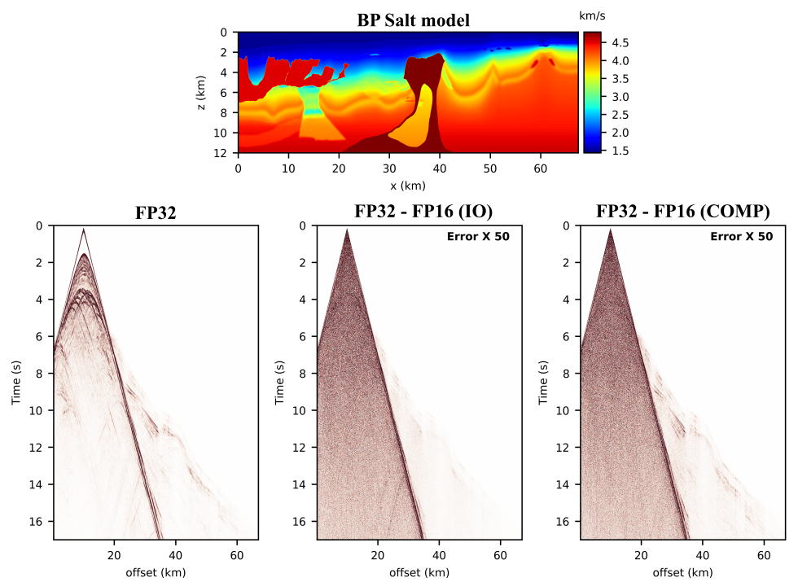

**Status:** Archive (code is provided as-is, no updates expected)

# Seismic modelling in FP16

This repository shows how 16 bit precision floating point numbers may be used in a
time-domain finite-difference code for solving the elastic wave equation. The provided
scripts reproduce the results shown in:

    Fabien-Ouellet G, (2018). Seismic modelling and inversion using half precision floating point numbers

For an example showing how to use FP16 within a CUDA kernel, look at the file [ `kernel_example.cl`](./kernel_example.cl). It is not runnable but is a more readable version of what can be
found in the full version of the code, named [SeisCL](https://github.com/gfabieno/SeisCL).

Also, the notebook [ `Scaling_the_wave_equation.ipynb`](./Scaling_the_wave_equation.ipynb)
explains the scaling strategy and shows its numerical validity.

## Installation

You should clone this repository:

    git clone https://github.com/GeoCode-polymtl/Seis_float16.git

You have two options to install all dependencies, especially SeisCL.

#### a) Use Docker (easiest)

We provide a Docker image that contains all necessary python libraries like Tensorflow
(for inversion) and the seismic modelling code SeisCL.

You first need to install the Docker Engine, following the instructions [here](https://docs.docker.com/install/).
To use GPUs, you also need to install the [Nvidia docker](https://github.com/NVIDIA/nvidia-docker).
For the later to work, Nvidia drivers should be installed.
Then, when in the project repository, build the docker image as follows:

    docker build -t seisf16:v0

You can then launch any of the python scripts in this repo as follows:

    docker run --gpus all -it\
               -v `pwd`:`pwd` -w `pwd` \
               --user $(id -u):$(id -g) \
               seisf16:v0 ./BPsalt.py

This makes accessible all gpus (`--gpus all`), mounting the current directory to a
to the same path in the docker (second line), running the docker as the current user
(for file permission), and runs the script `BPsalt.py`.

#### b) Install all requirements

It is recommended to create a new virtual environment for this project with Python3.

    virtualenv -p python3 seisf16
    source seisf16/bin/activate
    
Install [SeisCL](https://github.com/gfabieno/SeisCL) by following the
instruction in the README of the SeisCL repository. Either the Docker or the full
installation will work. It is mandatory to use the compiling option api=cuda, because fp16
computation is not implemented in the OpenCL version. You may also use nompi=1,
because no MPI parallelization is required. Be sure to install SeisCL's python wrapper.

Finally, all the python requirements can be installed with

    pip install -r requirements.txt

## Source code

To view how FP16 and the scaled wave equation was implemented, look at the
GPU kernels files in the SeisCL source code repository. Kernels implementing 2D
wave propagation are called [`update_v2D_half2.cl`](https://github.com/gfabieno/SeisCL/blob/master/src/update_v2D_half2.cl) and [`update_s2D_half2.cl`](https://github.com/gfabieno/SeisCL/blob/master/src/update_s2D_half2.cl).
Their adjoints are called [`update_adjv2D_half2.cl`](https://github.com/gfabieno/SeisCL/blob/master/src/update_adjv2D_half2.cl) and [`update_adjs2D_half2.cl`](https://github.com/gfabieno/SeisCL/blob/master/src/update_adjs2D_half2.cl).
The 3D kernels follow the same nomenclature.

Because the kernels are quite complex and use several macros, we provide an example
kernel in [ `kernel_example.cl`](./kernel_example.cl). This kernel is simplified but not runnable.
It shows the main strategies required to use half2 types in a finite difference code.

## Reproduce Figures

### Figure 2
To reproduce Figure 2:

    cd Fig2_acceleration/
    python measure_acc.py k40 0 2
    python plot_acc.py

This launches the computation for a device called k40, with no FP16 compute capacity
and in 2D. Note that if you want to plot the figure, you need access to all Nvidia GPUs
we had: the K40, M40, P100 and V100.  Then run the computations in 2D and 3D, and use
the plotting scripts `plot_acc.py`:

    python plot_acc.py

### Figures 3, 4 and 6
To reproduce Figure 3, 5 and 6 respectively:

    cd Fig3_4_6_error
    python marmousi2.py
    python BPsalt.py
    python EAGE_salt.py

### Figure 5
To reproduce Figure 5:

    cd Fig5_analytic
    python analytic.py

### Figure 7
To reproduce Figure 7:

    cd Fig7_inversion
    python create_data.py
    python Invert_fp32_fp16.py 1
    python Invert_fp32_fp16.py 2
    python Invert_fp32_fp16.py 3
    python plot_results.py

This may take a while.

### Figure 8
To reproduce Figure 8:

    cd Fig8_RTM
    python create_data.py
    python RTM.py 1
    python RTM.py 2
    python RTM.py 3
    python plot_results.py

